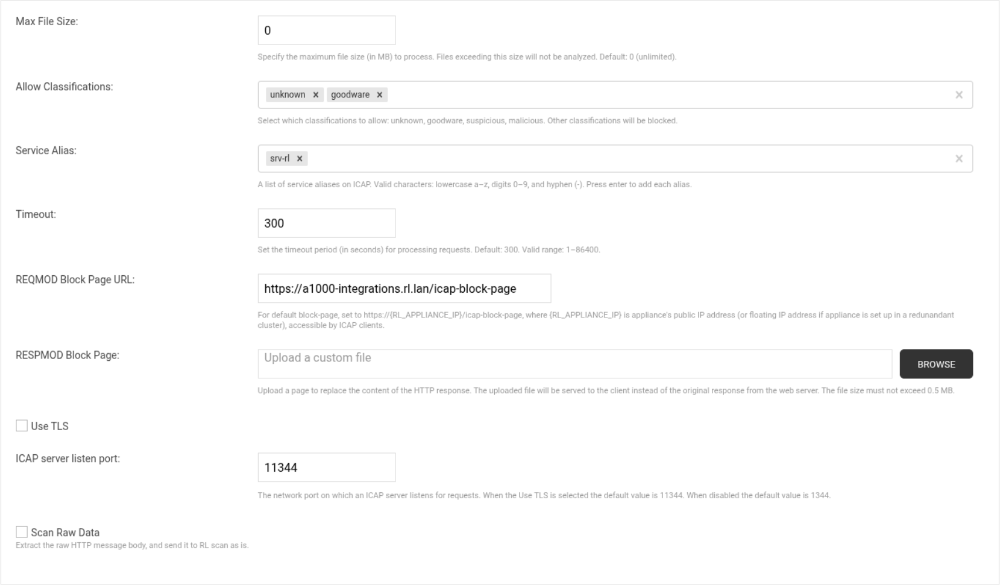

# F5 Nginx ICAP module

## Table of contents

1. [What this is](#1-what-this-is)
2. [Get the module](#2-get-the-module)
3. [Configure the module in nginx](#3-configure-the-module-in-nginx)
4. [Configure the ICAP server](#4-configure-the-icap-server)
5. [Run it with your own nginx](#5-run-it-with-your-own-nginx)
6. [Run it with the Docker stack (local)](#6-run-it-with-the-docker-stack-local)
7. [Run it on AWS (Terraform)](#7-run-it-on-aws-terraform)
8. [Further reading](#8-further-reading)

---

## 1. What this is

`ngx_http_detect_icap_module` is an nginx dynamic module that turns nginx
into an inline malware-scanning gateway. It intercepts uploads and downloads
passing through nginx, sends them to an ICAP (RFC 3507) server for a
verdict, and blocks anything malicious — before an upload reaches your
backend, and before a download reaches the client.

```
client ──upload──▶ NGINX (ngx_http_detect_icap_module)
                      │  REQMOD sub-request (RFC 3507)
                      ▼
                   ICAP Server (e.g. Detect)  ──verdict──▶  204 clean / 200+403 block
                      │
        clean ────────┴──────▶ proxy_pass ──▶ backend
        malware ─────────────▶ 403 to client, backend never sees the bytes
```

Two independent modes, both per-`location`: **REQMOD** scans upload bodies
(`POST`/`PUT`/etc.) before they reach the backend; **RESPMOD** scans
download bodies (`GET`) before they reach the client. Works with NGINX
**Community and Plus** (built `--with-compat`). Both modes fail closed.

---

## 2. Get the module

Download the package matching your target from
[github.com/reversinglabs/rl-nginx-icap-module/releases](https://github.com/reversinglabs/rl-nginx-icap-module/releases)
— pick the release built against the exact nginx core your target runs
(open-source nginx's own version, or the `nginx-X.Y.Z` your NGINX Plus
reports via `nginx -V`). A mismatch fails to load
(`module ... is not binary compatible`).

```bash
sudo apt install ./nginx-icap-module_<version>_amd64.deb
```

Installs the `.so` to `/usr/lib/nginx/modules/`. You still need to load it
yourself — see [§3](#3-configure-the-module-in-nginx).

Using the Docker stack instead ([§5](#5-run-it-with-the-docker-stack-local))?
Don't install it into a host nginx — copy the downloaded `.deb` into this
repo's `module/` folder and symlink it to `nginx-icap-module.deb` (see
`docker/README.md` Setup §1); the Docker image installs it at build time.

---

## 3. Configure the module in nginx

```nginx
load_module modules/ngx_http_detect_icap_module.so;   # before http {}

http {
    server {
        listen 8080;

        location / {
            detect_icap_pass         http://127.0.0.1:1344/detect;  # ICAP server URL — enables scanning
            detect_icap_methods      POST PUT;                      # REQMOD: which methods to scan
            detect_icap_resp_mode    on;                             # RESPMOD: also scan responses
            detect_icap_read_timeout 30s;                            # how long to wait for a verdict

            proxy_pass http://127.0.0.1:8000;
            proxy_set_header Host $host;
        }
    }
}
```

Full directive reference: `docs/MODULE.md`.

---

## 4. Configure the ICAP server



The bundled reference server (`icap-server/main.py`) needs no config to run
plaintext on `:1344` (matches `detect_icap_pass http://host:1344/detect;`
above). It blocks any body containing the EICAR test string or the literal
string `malware-demo-signature`; edit `SIGNATURES`/`scan_payload()` in that
file to change what it flags.

**ICAPS (TLS)** — off by default; set `ICAPS_CERTFILE`/`ICAPS_KEYFILE` to
enable a second listener on `:11344` (override with `ICAPS_PORT`):

```bash
openssl req -x509 -newkey rsa:2048 -keyout /tmp/icap-key.pem \
  -out /tmp/icap-cert.pem -days 1 -nodes -subj "/CN=icap"
ICAPS_CERTFILE=/tmp/icap-cert.pem ICAPS_KEYFILE=/tmp/icap-key.pem \
  python3 icap-server/main.py
```

Point nginx at it with `detect_icap_pass https://host:11344/detect;` (and
`detect_icap_ssl_verify off;` for this throwaway self-signed cert only).

**Real Detect/Spectra deployment instead of the reference server** — just
point `detect_icap_pass` at it; no server-side config here. For the Docker
stack, symlink `.env-rl-dev` (or `.env-rl-dev-tls` for ICAPS) instead of
`.env-local` — see [§6](#6-run-it-with-the-docker-stack-local).

---

## 5. Run it with your own nginx

```bash
# ICAP server (bundled reference, or point detect_icap_pass at a real one)
python3 icap-server/main.py

# backend
pip install -r backend/requirements.txt
python3 backend/main.py 8000 files

# nginx, using the config from §3 saved to e.g. my-nginx.conf
nginx -c "$(pwd)/my-nginx.conf"
```

```bash
curl -X POST --data-binary "hello" http://localhost:8080/up   # -> 200
```

---

## 5. Run it with the Docker stack (local)

Full reference (profiles, TLS, troubleshooting): `docker/README.md`.

```bash
mkdir -p module
cp /path/to/nginx-icap-module_*_amd64.deb module/
ln -sf "$(basename /path/to/nginx-icap-module_*_amd64.deb)" module/nginx-icap-module.deb

cd docker
ln -sf .env-local .env

# ce = NGINX Community; swap for plus to run NGINX Plus instead (needs
# NGINX_PLUS_SW_ROOT/NGINX_PLUS_DEB/NGINX_PLUS_LICENSE set in .env-local)
COMPOSE_PROFILES=ce,local-icap,test docker compose \
      -f docker-compose.yml -f docker-compose-certgen.yml up -d --build
```

```bash
docker compose exec tester sh -c \
  "curl -s -w '\nHTTP:%{http_code}\n' --cacert /certs/nginx-rproxy.crt -X POST --data-binary hello https://localhost/up"
```

Teardown:

```bash
COMPOSE_PROFILES=ce,local-icap,test docker compose \
      -f docker-compose.yml -f docker-compose-certgen.yml down
```

---

## 6. Run it on AWS (Terraform)

Full reference: `terraform/ec2-nginx/README.md`. Prerequisites: AWS
credentials, a pre-allocated Elastic IP, a DNS A record pointing at it
(needed for the Let's Encrypt HTTP-01 challenge), and — if using the `plus`
profile — an S3 bucket with your NGINX Plus package/license under
`versions/`/`license/` prefixes (`nginx_plus_s3_bucket` in `terraform.tfvars`).

```bash
cd terraform/ec2-nginx
cp terraform.tfvars.example terraform.tfvars
# edit: ssh_cidr_blocks, elastic_ip_allocation_id (see above)

terraform init
terraform apply
```

```bash
curl "$(terraform output -raw nginx_url)"
```

Teardown: `terraform destroy`.

---

## 7. Further reading

- `README.md` — project overview and all quickstart variants
- `docker/README.md` — full Docker stack reference
- `docs/MODULE.md` / `docs/ARCHITECTURE.md` — directive reference and
  system design (in the sibling `nginx-icap-module-src` repo)
- `docs/TESTING.md` / `certification/README.md` — build/certification
  details (also in `nginx-icap-module-src` — this repo only runs the
  module, it doesn't build or certify it)
- `terraform/ec2-nginx/README.md` — full Terraform reference
